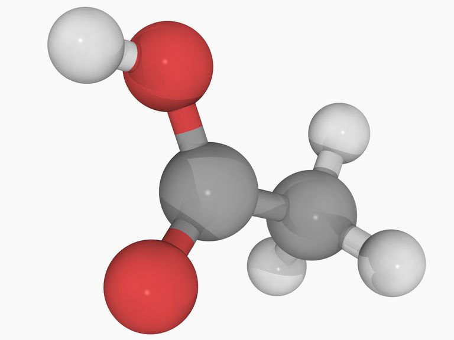

## <p style="text-align: center;"> NLP for Chemistry - Introduction and Recent Advances </p>




**[GitHub respository for the COLING/LREC 2024 tutorial on NLP for chemistry]**
<br>

Chemistry was for long a *terra incognita* for natural language processing (NLP). While strong overlap with computational and statistical physics (in e.g., so-called computational chemistry) gave rise to the application of many statistical models, methods derived from NLP have only reached wide acceptance in the past twenty years. The aim of this tutorial is to provide a basic introduction to this emerging field, and overview some of its latest advances. Given its breath, we will focus on four fundamental use cases. This tutorial will be organized as follows:

* **Topic 1**. Basic chemical notions and techniques.
* **Topic 2**. Text mining in the chemistry domain.
* **Topic 3**. Distributional models for (computational) chemistry.
* **Topic 4**. Large language models, multimodality, applications.

This tutorial assumes no prior knowledge, with the exception to exposure to Python and natural language processing. Knowledge of chemistry is beneficial but not required. For an overview of the topics, please read the proposal below. Please cite it as follows:
```bash
@misc{thorne-lrec-2024,
  	author		= {Thorne, Camilo and Saber Akhondi, Saber},
  	institution	= {Elsevier},
 	title 		= {NLP for Chemistry - Introduction and Recent Advances},
  	year 		= {2024},
  	url 		= {https://github.com/camilothorne/nlp-4-chemistry-lrec-2024}
}
````

<details>
	<summary>Proposal for COLING/LREC 2024 (PDF file)</summary>
<center>
<object data="./proposal-text/lrec-2024.pdf" type="application/pdf" width="300px" height="300px">
    <embed src="./proposal-text/lrec-2024.pdf">
        <p>This browser does not support PDFs. Please download the PDF to view it: <a href="./proposal-text/lrec-2024.pdf">Download PDF</a>.</p>
    </embed>
</object>
</center>
</details>

### Slides

TBD.

### Datasets

TBD.

### Notebooks

TBD.
